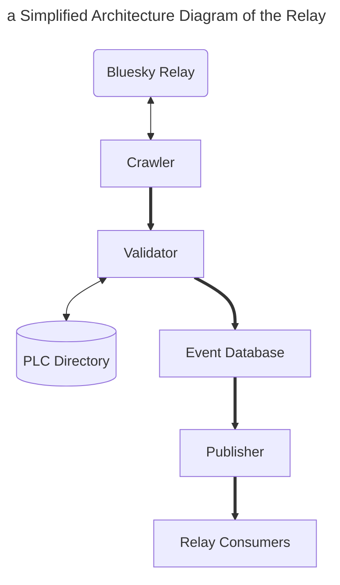

# Deploying the Rsky Relay
This section will outline how to deploy and tweak your own instance of the [rsky relay](https://github.com/blacksky-algorithms/rsky/tree/main/rsky-relay). This guide will aim to be cost effective, but one can tweak their instance to meet their goals. Finally, we'll be using GCP for this demonstration, but these concepts should be transferrable to other cloud hosting platforms.

## Introduction
You may be asking yourself "what is a [relay](https://atproto.com/guides/glossary#relay)?" and "why should I care about it?"

Imagine you are using an app built on the AT Protocol ([An AppView](https://docs.bsky.app/docs/advanced-guides/federation-architecture#app-views). Whenever a user interacts in the app: liking a post, creating a list, or following a user, it creates a change event (or commit) that is saved to the user's [data repository](https://atproto.com/guides/data-repos).

These changes are communicated to the [Personal Data Server](https://atproto.com/guides/glossary#pds-personal-data-server) that the data repositories are hosted on (PDS). **The Relay** communicates with the PDS and creates a single channel for AppViews to consume the event changes.

What we just described was the traditional relay, but the rsky-relay can also be configured to be a Labeler relay (mod relay). The difference between the two relay types is that a mod relay will look for change events from labelers.

This is important because it allows discoverability for other labelers. Before this, a user could only subscribe to a labeler if they already knew what labeler to look for, or if another user makes a post about the relay. Using this relay type would allow applications to show users all available labelers they can subscribe to.

## Things to Know
Our goal is to upload the rsky-relay container image to the cloud provider, create a virtual machine (VM) based on that image, and create a network rule that allows ingress (incoming), and egress (exiting) traffic on port `9000`.

Before guiding you through running your own instance of the rsky-relay, you should know where you want your relay to be hosted. You can either use a cloud provider like AWS, Azure, GCP, OCI, DigitalOcean, etc, or you can self-host. This tutorial uses GCP (not sponsored), but the concepts will apply to another provider you choose.

This tutorial uses a container image that does not run a full crawl of the network, doesn't have an SSL certificate, and uses 32 GB, instead of 320 GB. These choices were made to simplify deployment, and reduce initial costs.

Finally, we use `websocat` for testing our websocket connection.

## Relay Architecture
Below is a simplified diagram that explains the rsky-relay architecture.


\
During the initial startup of the relay, queries to Bluesky's relay are made every hour to discover and queue PDS instances to be crawled. During this time, the **Crawler** establishes WebSocket connections to the queued instances and ingests data.

That data is sent to the **Validator**, where it verifies the time and order a change event occurred, resolves DIDs, and verifies if all change events are using a specified cryptographic key(P-256 or K-256). You have the option to run a full crawl of the **PLC Directory** for all DIDs. If you do not want to run the script, be sure to add the `--no-plc-export` flag when running your instance.

When the change events are validated, it is stored in the shared **Event Database**. There are three parts to the database:
  - queue: change events that need to be validated
  - repos: tracks the state of data repositories
  - firehose: the event stream of validated change events ([Read More](https://docs.bsky.app/docs/advanced-guides/firehose))

As the change events are being stored, the **Publisher** serves all firehouse consumers the stream of validated events.


## Default Relay Configuration

Below, you will find runtime constants the traditional and Labeler relay use. The service type is defined at compile time. All of the following constants are defined in the *src/config.rs* file
e.g. `cargo build --release`
- Traditional Relay
- Labeler Relay

#### Message Queue Capacities (Uses Bit Shifting)
`CAPACITY_MSGS`: Maximum pending messages, default: 65,536\
`CAPACITY_REQS`: Maximum pending requests, default: 4,096\
`CAPACITY_STATUS`: Maximum status entries, default: 1,024

#### Worker Pools
`WORKERS_CRAWLERS`: Number of crawlers, default: 4\
`WORKERS_PUBLISHERS`: Number of publishers, default: 4

#### Network Configuration
`PORT`: Service port, default: 9000 for traditional, 9001 for Labeler\
`HOSTS_RELAY`: Upstream relay endpoint, default: `relay1.us-west.bsky.network`\
`HOSTS_INTERVAL`: how often the relay will refresh, default: 1 hour

#### Resolver Configuration
`DO_PLC_EXPORT`: Syncs with PLC Directory
- Traditional Mode: Enabled
- Labeler Mode: Disabled
> Can disable feature with the --no-plc-export flag

`PLC_EXPORT_INTERNAL`: How often the PLC syncs, default: 60 seconds\
`CAPACITY_CACHE`: Maximum number of DID resolutions cached, default: 262,144 entries

#### Validator Configuration
`HOSTS_WRITE_INTERVAL`: Frequency check for validated hosts, default: 10 seconds
``

#### Storage Management
`DISK_SIZE`: Maximum disk usage, default: 320 GiB\
`TTL_SECONDS`: Length of data retention, default:
- Traditional Relay: 24 hours
- Labeler Relay: Unlimited

#### Database Configuration
`CACHE_SIZE`: Amount of in-memory cache, default: 1 GiB\
`WRITE_BUFFER_SIZE`: The size of the write buffer, default: 512 MiB\
`MEMTABLE_SIZE`: Size of the memory table before compaction, default 64 MiB\
`BLOCK_SIZE`: Disk I/O block size, default: 64 KiB\
`FSYNC_MS`: Disk sync interval, default: 1 second


## Traditional Relay Walkthrough
1. You will need to create an account with the cloud provider of your choosing.
2. Next, head to the VM section, for GCP, click on the navigation menu (or press . on your keyboard), select Compute Engine, then VM instances.
3. Click on the "Create Instance" button towards the top of the screen. You'll start at the "Machine Configuration" screen. For the purpose of this walkthrough, I selected E2 Small, which comes with 1 shared core, 2 GB of RAM, and 64 GB of storage. **Make sure to choose a region that meets your needs.**
4. Click on the "OS and storage" section, and click on "Deploy container".
5. In the first field, labeled "Container Image", paste the image address: blacksky/rsky-relay:latest. When you are done, you can press the "Select" button.
6. Click on the "Networking" section, and make sure to select "Allow HTTP traffic", and "Allow HTTPS traffic".
7. Once you are finished making those changes, click on the "Create" button.
8. After the instance has finished being created, you will need to create a network rule to allow traffic to be sent and recieved on port `9000`.
9. Click on the navigation menu, and select VPC Network > VPC networks. Make sure you have selected the VPC that is assigned to your newly created relay instance.
10. Click on the "Add firewall Rule", and you are going to create two rules.
    1. an ingress rule that allows traffic on port `9000`.
    2. an egress rule that allows traffic on port `9000`.

With the final step complete, you should now be able to go use `websocat` to create a WebSocket connection with our relay! Run the following command and replace the placeholder variable with your instance's external IP Address.
```bash
websocat -k ws://<external-ip-address>:9000/xrpc/com.atproto.sync.subscribeRepos?cursor=0
```

## Labeler Relay Walkthrough
Hosting a labeler relay is the same as the previously mentioned instructions, however, you will run the following command, instead:

```bash
websocat -k ws://<external-ip-address>:9001/xprc/com.atproto.label.subscribeLabels?cursor=1
```
## Findings
Monitoring the relay that was created for this tutorial (July 31 to Aug 20), this setup costed $26.95 to host, and $1.41 for networking. A client was periodically consuming this connection, but there will be an action item to stress test the relay based on different types of configs.
