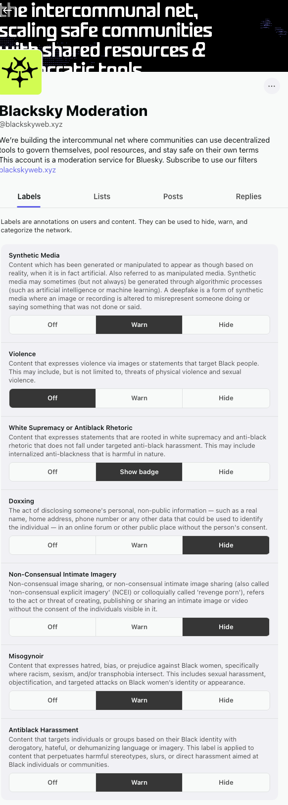

# Blacksky Moderation and Labeler

Any content labeled by Bluesky's AI-based labeler is automatically filtered out of the feed as soon as it is labeled. This usually occurs at the time of posting, but can happen later.

Labels (defined by Bluesky) are annotations on users and content. They can be used to hide, warn, and categorize posts and users on the network.&#x20;

Blacksky has its own independent moderation service, The Blacksky Moderation Service,  that is used to mitigate the harm that Black users experience on Bluesky via the [Blacksky Moderation Service](https://blacksky.community/profile/did:plc:d2mkddsbmnrgr3domzg5qexf). \

You have to **subscribe** to the moderation service via Bluesky unless you are using the web app [blacksky.community](https://blacksky.community). Our moderation service is automatically built into our web app.

\

<figure><figcaption></figcaption></figure>

Other content that doesn't belong in the feed can be reported to the [Blacksky Moderation Service](https://blacksky.community/profile/did:plc:d2mkddsbmnrgr3domzg5qexf), where a team of moderators will review the content for removal from the feed.

Blacksky filters out sexually explicit images based on labels from the official Bluesky Moderation Service (@moderation.bsky.app) for the main Blacksky and Blacksky Trending feeds.

We may label the content, add the user to the Green List, and/or prevent the user from viewing the Blacksky feed.

&#x20;


Do not publicly “flag” posts (for example, by reposting them or responding in a reply). Harassers can use that public engagement to target you later or escalate conflict. Use the [Blacksky Moderation Service](https://blacksky.community/profile/did:plc:d2mkddsbmnrgr3domzg5qexf) to report harassers to ensure confidentiality and to protect your peace on Blacksky and Bluesky.


The moderation service gives you a discreet way to report harmful content and allows Blacksky to enable protective features. For example, the Blacksky “Banned from TV” feature can block certain reported accounts from even seeing the feed.

Any accounts blocked by “Banned From TV” will see the following when trying to load any of the Blacksky feeds:

***

**Quick Reminders:**


Labels provide additional filtering. There are three options for how you choose to view labeled content on your feed: off, warn, or hide.


<figure><figcaption></figcaption></figure>


Our Labeler service cannot delete content from the network; instead, moderation labels (eg. anti-black harassment) are attached to content or an account.


<figure><figcaption></figcaption></figure>


Subscriptions to labelers are private –  other users will not know you are subscribed.&#x20;


### **Below are our current labels:**

💡Note: These labels are subject to change based on moderation needs and input from the community via [assembly](https://assembly.blacksky.community/).&#x20;

#### **Anti-Black Harassment**

This category covers any harassing, abusive, or dehumanizing content targeting Black people. It includes:\

* **Racial Slurs**\
  Any derogatory term for Black individuals (e.g. the N-word). Use of these slurs directed at a person or group is an automatic violation
* Even censored/masked slurs count, including usage in hashtags or usernames

* **Stereotyping & Hate Speech**\
  Content painting Black people as inferior, criminal, unintelligent, etc
* Example: A post that belittles a Black person’s death or refers to harmful stereotypes

* **Threats or Violent Wishes**\
  Calls for violence against Black people or threats directed at Black individuals\

Immediate escalation to Blacksky Admin is typical, as threats violate base community standards

* **Derogatory Memes & Tropes**\
  Images or memes evoking racist tropes (e.g. comparing Black people to apes)

#### Ambiguous usage of slurs

Sometimes slurs appear in non-harassing contexts:

* In-group usage (Black user reclaiming a slur among friends)
* Quoting a slur to condemn it
* Not considered harassment. Example: “User X called me a ‘n—–’. This is not okay.”
* We do not penalize the user for exposing the harassment
* Black public figures using provocative language
* If it’s not directed as harassment, we generally do not label or remove. (E.g. lyrics.)

#### **Misogynoir**&#x20;

Misogynoir is the intersection of anti-black racism and sexism targeting Black women and Black nonbinary, agender, and gender-variant folks Black women, often involving specific stereotypes or tropes:\

* Gendered slurs or insults aimed at Black women
* Tropes like the “angry Black woman,” hypersexualization, or remarks that Black women are undesirable because they are Black

#### **Violence**

Content that expresses violence via images or statements that target Black people. This may include, but is not limited to, threats of physical violence and sexual violence.

This may include, but is not limited to, threats of physical and/or sexual violence through images or statements targeted at Black people

* Photos of Black people being harmed, such as pictures of George Floyd or Michelle Obama, being decapitated or being lynched
* Statements threatening violence directed at Black people

#### Synthetic Media&#x20;

Content that has been generated or manipulated to appear as though based on reality, when it is in fact artificial. Also referred to as manipulated media. Synthetic media may sometimes (but not always) be generated through algorithmic processes (such as artificial intelligence or machine learning). A deepfake is a form of synthetic media where an image or recording is altered to misrepresent someone doing or saying something that was not done or said.

Media (images or videos) that are generated or manipulated (through things like artificial intelligence or machine learning) that target Black people or misrepresent Black people.&#x20;

* Artificial videos or images, such as using deepfake to misrepresent a Black person on Blacksky, doing or saying something that is not real

#### White Supremacy or Anti-Black Rhetoric

Content that expresses statements that are rooted in white supremacy and anti-black rhetoric does not fall under targeted anti-black harassment. This may include internalized anti-blackness that is harmful in nature.

Statements that reinforce ideas of white supremacy or anti-black rhetoric that **do not** fall under harassment. This also includes internalized anti-blackness that is harmful in nature.&#x20;

* Generalizations rooted in anti-blackness (eg. respectability politics) that incite harm towards Black people

#### Doxxing

The act of disclosing someone's personal, non-public information — such as a real name, home address, phone number, or any other data that could be used to identify the individual — in an online forum or other public place without the person's consent

#### Non-Consensual Intimate Imagery&#x20;

Non-consensual image sharing, or non-consensual intimate image sharing (also called 'non-consensual explicit imagery' (NCEI) or colloquially called 'revenge porn'), refers to the act or threat of creating, publishing, or sharing an intimate image or video without the consent of the individuals visible in it

* Sharing someone’s personal nude photos or sexually explicit videos without their permission, revenge porn
* Posting deepfake porn of someone on the feed

***

If you see something that doesn’t belong in the Blacksky feeds, report it to [Blacksky Moderation Service](https://blacksky.community/profile/did:plc:d2mkddsbmnrgr3domzg5qexf):

* Report posts or users for antiblackness or misogynoir
* Report harassment of Black people anywhere on Bluesky
* Report content that could otherwise harm Black people (for example, screenshots of racist posts on other platforms)

Blacksky will continue to work with the community to add new labels and moderation solutions to make the feed and app a safe space for users.
