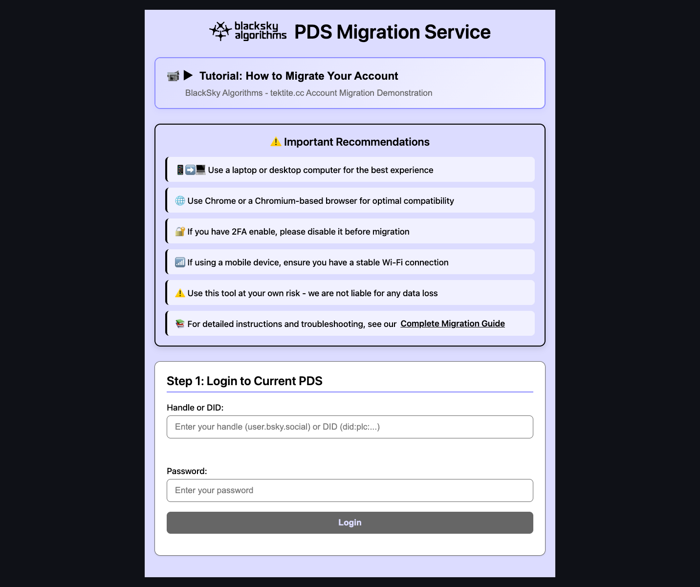
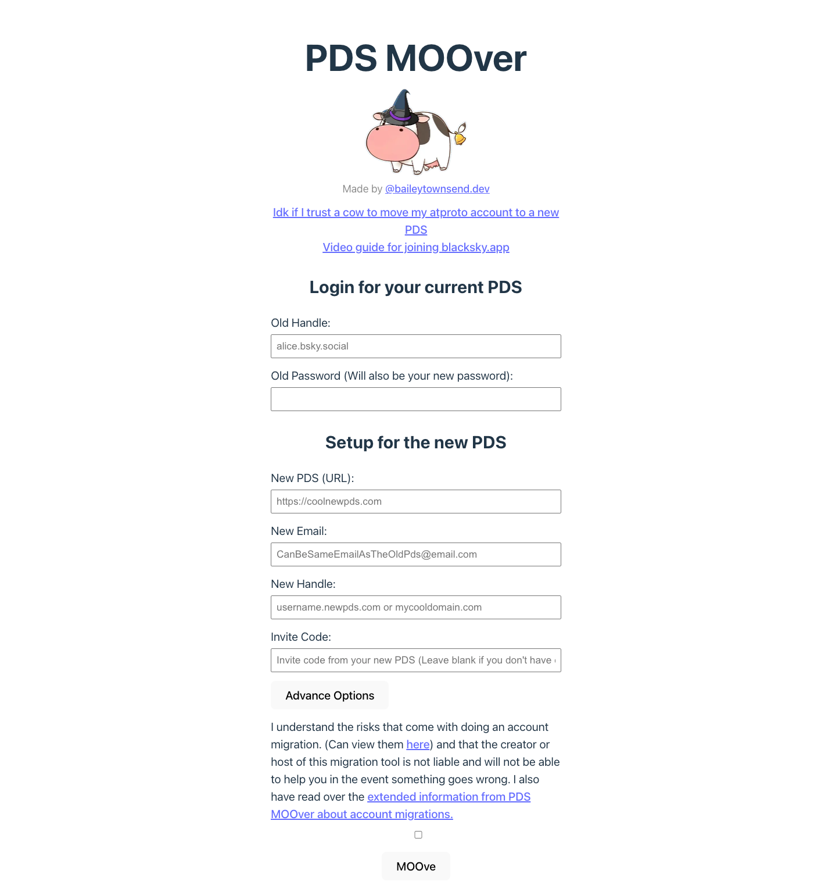
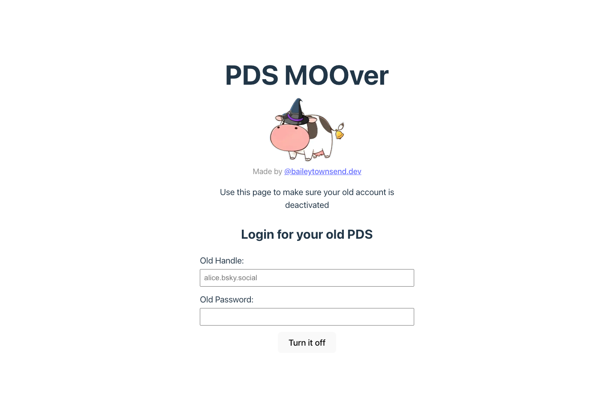
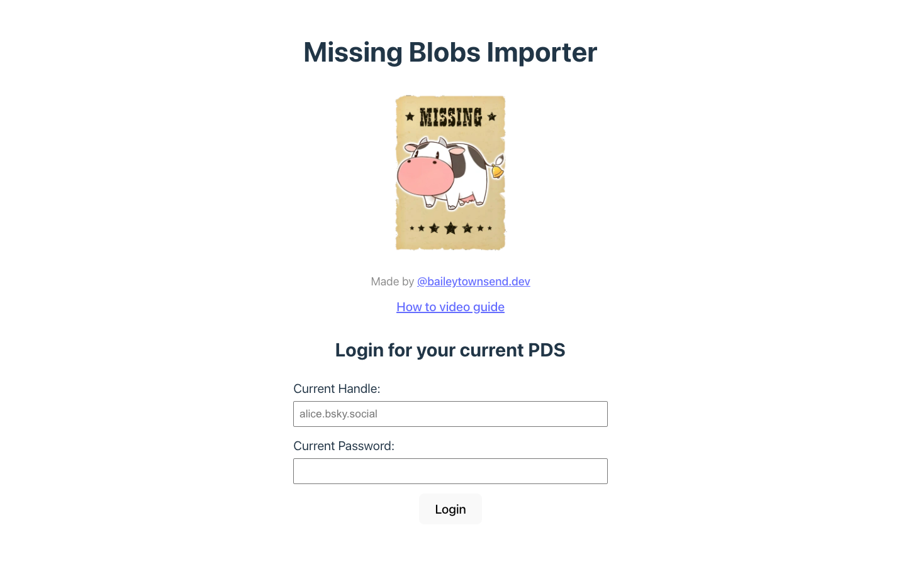
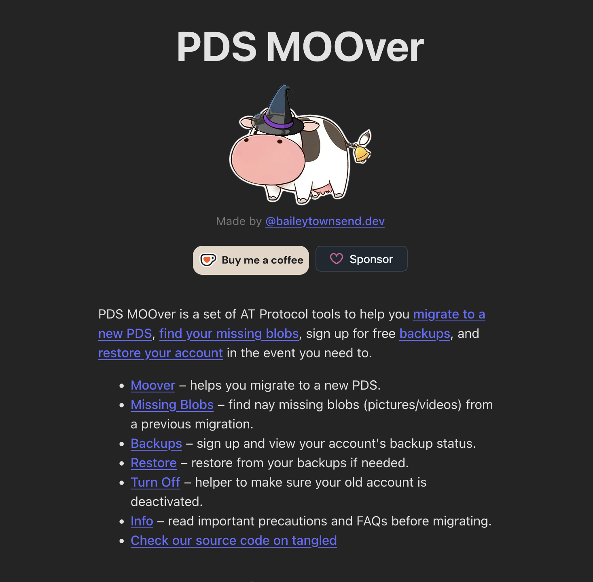

# Migrating to Blacksky PDS: Complete Guide

### About Blacksky

Blacksky is communal infrastructure for the atproto network, built on the vision of making communal practices of mutual aid a normal practice. All code is open source and operates with complete transparency.

**Important**: Blacksky as a community exists across multiple PDSs (Personal Data Servers) — this is intentional and by design.&#x20;

Also note that new users without an existing Bluesky or Blacksky account can easily sign up directly at [https://blacksky.community](https://blacksky.community/) to be hosted on one of our PDSs. The remainder of this document discusses migrating an existing account hosted elsewhere (Bluesky, another 3rd-party PDS, etc.)

<figure><figcaption></figcaption></figure>

<figure><figcaption></figcaption></figure>

### Who Can Use Blacksky Services?

#### blacksky.app - For Blacksky Community Members Only

**blacksky.app** is exclusively for members of the Blacksky community. This PDS has specific membership requirements and is reserved for Black folks building communal infrastructure.

⚠️ **Warning**: Anyone else using a blacksky.app handle will receive a warning at first and then a suspension.

#### Alternative PDSs for Everyone

Blacksky Algorithms also operates two other PDSs that are **open to anyone**:

* **myatproto.social** - Open to all
* **cryptoanarchy.network** - Open to all

These servers run on the same infrastructure as blacksky.app and are maintained by the same team, but are available for anyone to use regardless of background.

💡 **Note:** whether your handle is _username.myatproto.social_ or _username.cryptoanarchy.network_ you must still enter "https://blacksky.app" as your hosting provider when logging into apps that request a "Hosting Provider" such as the Bluesky mobile apps.

#### Other Community Options

Additional community-run PDSs you might consider:

* [transrights.northsky.social](https://northskysocial.com/join) - 2SLGBTQIA+ community
* [pds.witchcraft.systems](https://pds.witchcraft.systems/) - contact directly for invite
* [selfhosted.social](https://selfhosted.social/) - contact directly for invite

### How to Use Blacksky (Without Migrating)

You don't need to migrate your account to use Blacksky's features:

**Option 1: Use the Web App**

* Visit **blacksky.community**
* Log in with your existing account
* No migration required
* Gets you around age verification and geolocation restrictions
* Blacksky moderation and feeds are built in

**Option 2: Use the Mobile App** When logging into the official Bluesky app:

1. Change the "Hosting Provider" (above username field) to `https://blacksky.app`
2. Then log in as normal

### Migration Guide

If you want to move your account hosting to one of Blacksky's PDSs, follow these steps:

#### What Migration Does

* Moves your account hosting from Bluesky PBC to Blacksky (or another PDS)
* Puts you under Blacksky's [Terms of Service](https://blackskyweb.xyz/about/support/tos/) and [Privacy Policy](https://blackskyweb.xyz/about/support/privacy-policy/) instead of Bluesky's
* **You keep all your followers, follows, posts, and data**
* You can change your handle (e.g., from `name.bsky.social` to `name.blacksky.app`)

#### Migration Tools

Two tools are available for migration:

* [**tektite.cc**](https://tektite.cc/) - Built and maintained by the Blacksky team

<figure><figcaption></figcaption></figure>

* [**pdsmoover.com**](https://pdsmoover.com/) - Alternative option with additional troubleshooting tools

<figure><figcaption></figcaption></figure>

#### Step-by-Step Migration

1. **Choose Your New Handle**
   * For Blacksky community members: `username.blacksky.app`
   * For everyone else: `username.myatproto.social` or `username.cryptoanarchy.network`
2. **Go to Migration Tool**
   * Visit [tektite.cc](https://tektite.cc/) or [pdsmoover.com](https://pdsmoover.com/)
3. **Enter Account Information**
   * **Old handle**: Your current handle (e.g., `alice.bsky.social`)
   * **New handle**: Your desired new handle (e.g., `alice.blacksky.app`)
   * ⚠️ **Important**: Type these out manually, don't copy/paste (invisible characters can cause issues. If you get invalid handle errors, this is likely why.)
4. **Advanced Options** (if needed)
   * If migration fails to complete when using pdsmoover.com, click "Advanced Options"
   * Uncheck "create account"
   * Try again
5. **Complete Migration**
   * Follow the prompts
   * Wait for the migration to complete

For a video guide on these steps, check out Sharpie's post [here](https://blacksky.community/profile/did:plc:g7j6qok5us4hjqlwjxwrrkjm/post/3lw3hcuojck2u).

#### Post-Migration Steps

**Fix Old Account Issues:**&#x20;

If people can't reply to you after migration:

1. Visit [pdsmoover.com/turnoff.html](https://pdsmoover.com/turnoff.html)
2. Log in with your **old** account credentials
3. Deactivate the old account properly

<figure><figcaption></figcaption></figure>

**Fix Missing Images**

If images from before your migration aren't showing or you're having issues editing your profile:

1. Visit [missing.pdsmoover.com](https://missing.pdsmoover.com/)
2. Follow the instructions to backfill your images

<figure><figcaption></figcaption></figure>

**Restore Backups and other PDS Issues:**

You can now use PDS Moover to take care of the items listed above and also restore your data. You can find more detailed information from Bailey here:



<figure><figcaption></figcaption></figure>

**Change Your Handle Domain**

If you want to switch between handle options (blacksky.app, myatproto.social, cryptoanarchy.network) or use your own custom domain:

1. Visit [blacksky.community](https://blacksky.community/)
2. Log in to your account
3. Navigate to settings
4. Change your handle to any of the available options or a domain you own

<figure><figcaption></figcaption></figure>

### Troubleshooting

#### "Can't create account" or "Handle already exists"

* Click "Advanced Options" when migrating
* Uncheck "create account"
* Complete the migration

#### Images not loading after migration OR can't update profile (missing blobs)

In AT Protocol, blobs (Binary Large OBjects) are your media (images, video, etc.).

* Use [missing.pdsmoover.com](https://missing.pdsmoover.com/) to fix image backfill

<figure><figcaption></figcaption></figure>

#### People can't reply to your posts

* Visit [pdsmoover.com/turnoff.html](https://pdsmoover.com/turnoff.html)
* Deactivate your old account using old credentials

<figure><figcaption></figcaption></figure>

#### Getting message to reactivate my account

* Your account migration hasn't completed if you didn't enter the PLC token into the migration tool you were using. Go back and complete the migration.

#### I never got a PLC token email

Make sure your current email in the Bluesky app is verified and that you have access to it. Also check spam. If you no longer have access to the email you used to sign up with Bluesky, contact support@bsky.app to get it updated. **You need a verified email that you have access to in order to complete the migration.**

#### Migration tool showing other errors (unable to resolve handle)

* Make sure you typed handles manually (no copy/paste)
* Check for typos in old or new handle
* Old handle format: `name.bsky.social`
* New handle format: `name.blacksky.app` (or myatproto.social, cryptoanarchy.network)
* Try using incognito on Google Chrome using a laptop/desktop machine

#### Need more help?

* Email: support@blacksky.app

### Features & Resources

#### Blacksky Features

* **Web App**: [blacksky.community](https://blacksky.community/)
* **Built-in Moderation**: Blacksky's moderation is baked into the web app
* **Core Feeds**: Blacksky feeds are default
* **Privacy**: No public list of Blacksky members, building private spaces
* **Open Source**: All code is transparent ([GitHub](https://github.com/blacksky-algorithms/blacksky.community))
* **Feature Requests:** Use our democratic deliberation tool ([People's Assembly](https://assembly.blacksky.community/8bbfunvvau))
* **Bug Reports:** We track issues in [Github](https://github.com/blacksky-algorithms/blacksky.community/issues/new/choose)

#### Getting Involved

* **Overview**: [blackskyweb.xyz/overview/](https://blackskyweb.xyz/overview/)
* **Support**: Voluntary, sliding-scale recurring subscriptions (not tax-deductible donations) [https://opencollective.com/blacksky/contribute/backer-59760/checkout](https://opencollective.com/blacksky/contribute/backer-59760/checkout)

### Additional Notes

* **No invite codes required** - Open signups available
* **Network-wide connection** - Although you're on the Blacksky server, you can still speak with folks on Bluesky and they can still see and interact with you
* **Multiple options** - You can use just the web app, just migrate, or both
* **Rate limits** - Blacksky has rate limits to prevent abuse
* **No geolocation tracking** - Blacksky doesn't do specific geolocation tracking

***

**Last Updated**: October 2025
